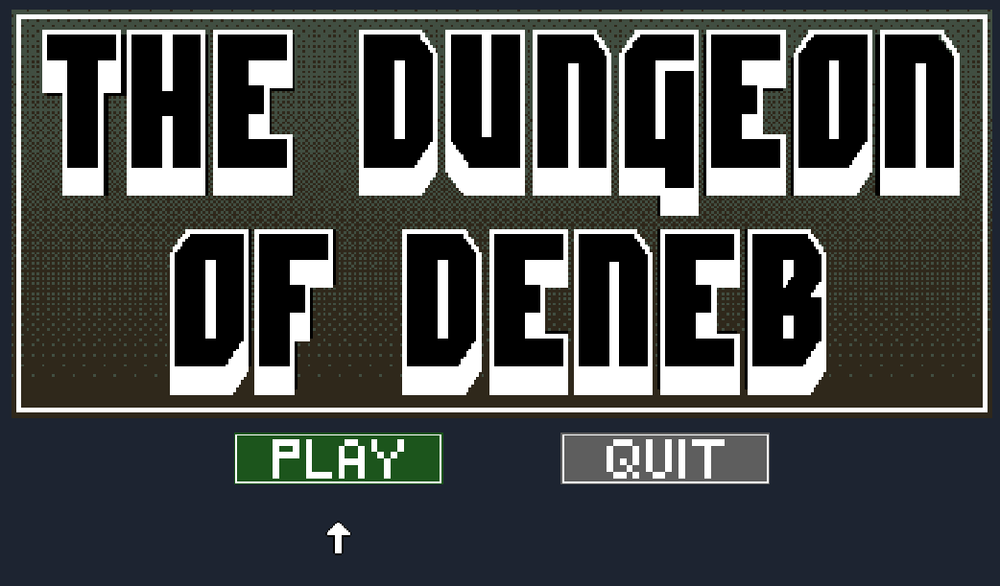

In one of the last projects I'm doing for school, I'm working on a game wherein everything in the game is _procedurally generated_ using a dungeon-building algorithm.

## Fresh Content Each Time

One of the main draws of building a [Roguelike game](https://en.wikipedia.org/wiki/Roguelike) is figuring out how to procedurally generate dungeons. While it's difficult to replicate the high-quality hand-crafted content of titles like _Legend of Zelda: A Link to the Past_, you can approximate a lot of the same experience while coming up with a new layout each time the game is loaded. 

Achieving this is, as you may imagine, pretty difficult.

There are a lot of resources online, but most of them follow the same pattern - create a set of rooms, connect them, place items within them. There's a significant amount of wiggle room within those, but that's the basics.

## Unity Set Up

The dungeon I built is based on a Unity Tilemap, which is effective a grid of 1x1 squares that you can place tiles within. For the game that I'm working on, I made each tile 16x16 pixels (you can set them to the density that you're planning on making your tile sprites).

The unity objects involved:

* Two tilemaps (Created by Game Object > 2D Object > Tilemap). Spawning a tilemap will create a Grid object as its parent. I created two Tilemaps and connected them to the same parent. I attached my `Dungeon.cs` building script as a component to this parent.
    * Floor tilemap - This is what I use to tile the floor background, and this is the main data for the dungeon layout (since walls are just created using the floor layout).
    * Walls (Collidable) tilemap - This one has a collider added to it, so the player can't walk through them.
* Tile Palette - This contains all of the floor / wall tiles that I use to build the dungeon. It's nice to have one of these so you can manually paint some on if you want.

## The Algorithm

Since dungeon generation algorithms can fall into a number of ways that they can end up in an infinite loop where they will _never_ end up with a good dungeon layout, it's best to program each step of this in the following way:

- While not at my limit of tries
- Try
- If failed, reset everything and increment how many tries I've done.

### Steps

1. Place a number of rooms in a grid.
2. Derive a graph for the grid. The recommended way I found to do this was to create a Delauney Triangulation. This is somewhat complicated, so it's recommended to [find an algorithm or package that will do this for you](http://www.personal.psu.edu/cxc11/AERSP560/DELAUNEY/13_Two_algorithms_Delauney.pdf).
3. From that graph, derive a minimum spanning tree. I found that this was easy enough to do using Prim's Algorithm, which is greedy and runs quickly.
4. Verify that the graph meets your desired gameplay goals. For me, I wanted to make sure that I had at least two non-overlapping subtrees that comprised >25% of the nodes in the tree, so that I could use these as specific gameplay areas.
5. Connect all the parent/child relationships in the tree with corridors.
6. Once that's done, add some optional corridors for the nodes within the same subtree, so that you can remove the perfect "tree"-ness of the layout and add some variety to it.
7. Choose a boss room. For mine, I simply chose a leaf node in the larger subtree with a higher-than-average floor area.
8. Choose rooms to place keys in that will open locked doors.
9. Lock the doors.
10. Place items and enemies within those rooms according to some sort of sliding difficulty scale. You can easily derive this difficulty on a number of simple heuristics (i.e. bigger room = more enemies, further depth in tree = harder enemies, etc).

Go!

## Layouts Generated

First, a key, so you can understand what you're looking at:

* Rooms:
    * Green / White = starting room / starting area
    * Red = boss room
    * Light blue = harder-than-starter area, Dark Blue = advanced area
    * Yellow = room with a key
* Corridors:
    * White - Parent/child relationship in tree
    * Yellow - Optional corridor added between two rooms in the same subtree.

The key to the light blue area spawns in the green / white area, the key to the dark blue area spawns in the light blue area. The key to the boss room is placed within the dark blue area.

As you can see in this one, sometimes the room with a key in it spawns _directly_ next to the boss (in the first example above), but sometimes it's located fairly far away in a different corner (in this example, on the bottom left).

In this example, I've included the minimum spanning tree generated during the dungeon building process. If you note the yellow corridors between rooms, those are randomly added between rooms within the same subtree.

## Applying Tiles

The [`TileMap.SetTile`](https://docs.unity3d.com/ScriptReference/Tilemaps.Tilemap.SetTile.html) function can then be used to programmatically fill out which tiles are supposed to go where. Once you've got the room data figured out, it's pretty easy to determine where to set tiles (floor tiles set within any room or corridor, wall tiles set in any empty space that borders a corridor or room).

The result:

From here, you can generate the items and enemies how you see fit.
